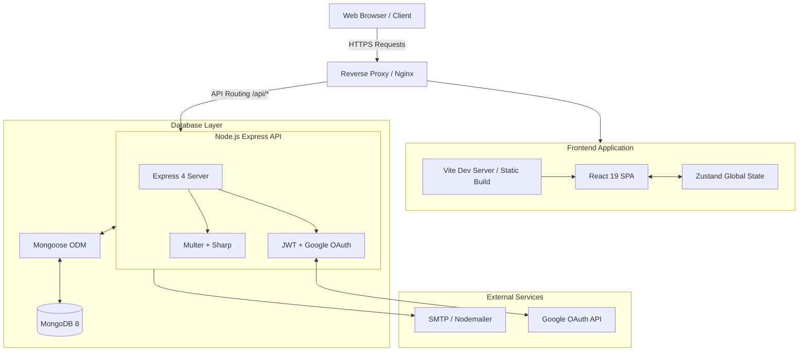

```yaml
Title: Architecture Overview
Version: 1.0.0
Status: Active
Owner: Prashant (CTO)
Last Updated: 2026-07-19
Dependencies: None
Related Documents:
  - 04-backend/database-schema.md
  - 04-backend/api-specification.md
```

# 🏗️ Architecture Overview — Ami Infracon LLP

## 1. Overview
Ami Infracon LLP employs a decoupled, modern web architecture. It separates a React-based Single Page Application (SPA) frontend from a Node.js REST API backend, utilizing MongoDB as the primary data store. This architecture provides high interactivity on the client side while maintaining robust, scalable data processing on the server.

## 2. High-Level System Diagram



## 3. Frontend Architecture (`Frontend/`)
- **Framework:** React 19 bootstrapped with Vite 7 for rapid Hot Module Replacement (HMR) and optimized production builds.
- **Routing:** React Router 7 manages client-side navigation, including strict route guards (`ProtectedRoute`, `AdminProtectedRoute`).
- **State Management:** Zustand (`app/userStore.js`) manages global user sessions, auth tokens, and shopping cart state efficiently without the boilerplate of Redux.
- **Network Layer:** A centralized Axios instance (`utils/axiosInstance.js`) intercepts all outgoing requests to append JWT tokens and intercepts incoming responses to handle 401 token refreshes centrally.
- **Styling & UI:** Tailwind CSS 4 provides utility-first styling. Complex micro-interactions are handled via `animejs`.

## 4. Backend Architecture (`backend/`)
- **Framework:** Node.js (ESM) with Express 4.
- **Structure:** MVC-inspired pattern. Routes map to Controllers, which interact with Mongoose Models.
- **Error Handling:** Centralized. Controllers are wrapped in an `asyncHandler`. Custom `ApiError` and `ApiResponse` classes ensure uniform JSON payloads across all endpoints.
- **Security:**
  - `express-rate-shield` protects against DDoS and brute-force attacks.
  - JWTs are used for stateless session management.
  - CORS is strictly configured via the `ALLOWED_ORIGINS` environment variable.
- **File Processing:** Uploaded images and CSVs are intercepted by `multer`. Images are processed by `sharp` (resizing/compression) before being saved to the local filesystem (pending S3 migration).

## 5. Database Architecture
- **Engine:** MongoDB 8, accessed via Mongoose.
- **Core Collections:**
  - `User`: Customers with encrypted passwords and default shipping addresses.
  - `Admin`: Internal users with a `role` enum (`admin` or `superadmin`).
  - `Product`: Catalog items with pricing, category, and `lowStockThreshold`.
  - `Order`: Transaction records containing a `statusHistory` array for the timeline feature.
  - `Blog`: Markdown/HTML content for the knowledge base.

## 6. Scalability & Deployment Considerations
- **Current State:** The backend writes images to local disk (`public/uploads/`). This is a stateful constraint.
- **Production Requirement:** Before deploying to ephemeral container services (like Render or AWS ECS), the storage layer must be abstracted to an S3-compatible object store.
- **Database Scaling:** MongoDB Atlas is recommended for production to offload database maintenance, backups, and replication.

---
> **CTO Note:** This decoupled approach ensures that if we later decide to build a native mobile app for B2B contractors, the Express API is already perfectly positioned to serve it without modification. Adhere strictly to the `ApiResponse` contract to maintain this interoperability.
