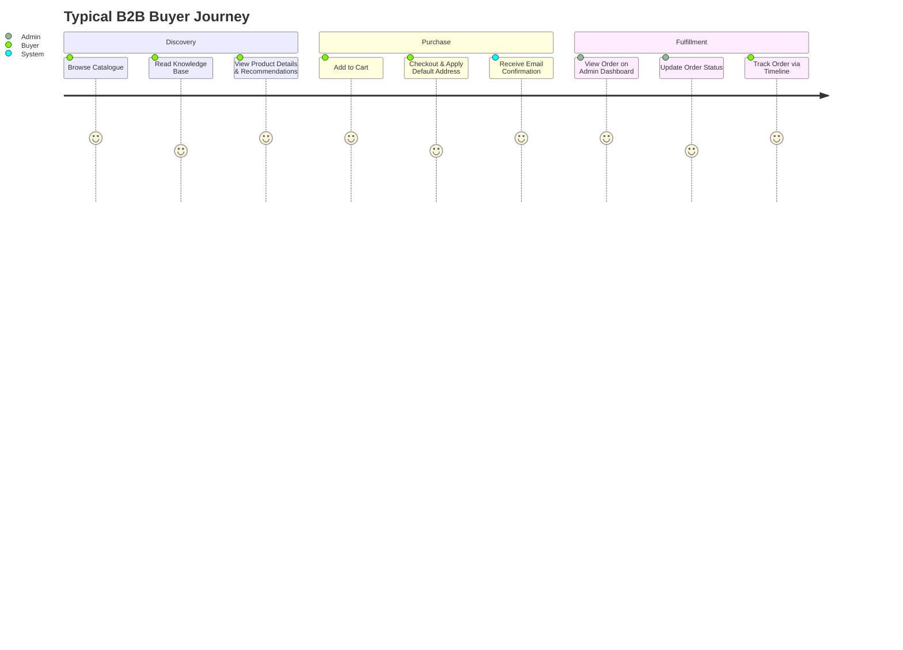

```yaml
Title: Product Overview
Version: 1.0.0
Status: Active
Owner: Prashant (CTO)
Last Updated: 2026-07-19
Dependencies: None
Related Documents:
  - 00-project/vision.md
  - 00-project/architecture-overview.md
  - 01-product/prd.md
```

# 📦 Product Overview — Ami Infracon LLP

## 1. Executive Summary
Ami Infracon LLP is a robust, enterprise-grade B2B e-commerce platform designed specifically for the distribution of construction chemicals. The product provides a dual-faceted experience: a streamlined, public-facing digital storefront for buyers to browse and purchase bulk materials, and a powerful, tiered administrative back-office for internal teams to manage inventory, orders, users, and content.

## 2. Core Value Proposition
The platform digitizes traditional, high-friction B2B wholesale workflows. It replaces offline negotiations, manual order entry, and opaque inventory tracking with a real-time, transparent digital experience. This shift significantly reduces operational overhead for Ami Infracon while empowering clients with self-service capabilities.

## 3. Key Product Features

### 3.1 Digital Storefront (B2B Buyers)
- **Product Catalogue:** A comprehensive, searchable database of construction chemicals with detailed specifications.
- **Related Products Recommendation Engine:** Surfaces complementary products dynamically to increase average order value.
- **Cart & Checkout:** Optimized for B2B transactions, supporting bulk orders and specialized terms.
- **Order Tracking:** A visual, step-by-step order timeline indicating current status (e.g., Pending, Processing, Shipped, Delivered).
- **User Profiles:** Self-serve management of company details and a default shipping address.
- **Knowledge Base (Blog):** Access to technical articles, safety data sheets, and application guides.

### 3.2 Administrative Back-Office (Internal Teams)
- **Tiered Access Control:** Delineated roles between standard `Admin` (operations, catalog management) and `SuperAdmin` (system oversight, revenue tracking).
- **Analytics Dashboard:** Real-time metrics including total revenue, order volume, user registration trends, and top-performing products, powered by robust backend aggregation and frontend charting (`recharts`).
- **Inventory Management & Alerts:** Automated monitoring of product stock against a configurable `lowStockThreshold`, triggering dashboard alerts when replenishment is needed.
- **Bulk Product Import:** A CSV upload pipeline for rapidly updating the product catalog, ensuring data consistency via `csv-parser`.
- **Content Management:** A rich-text editor for managing the public Blog/Knowledge Base.

### 3.3 System Automation
- **Order Confirmations:** Automated transactional emails dispatched via `nodemailer` immediately upon order placement.
- **Image Processing:** Automated resizing and optimization of product imagery utilizing `multer` and `sharp` to ensure fast page loads.

## 4. High-Level User Flow



## 5. Technology Philosophy
The product is built on a modern, decoupled architecture (React/Vite frontend, Node.js/Express backend, MongoDB). This stack was chosen for its rapid development cycle, scalable data modeling (crucial for complex B2B product catalogs), and rich ecosystem of UI libraries (Tailwind CSS 4, anime.js) that allow for a highly interactive, application-like feel rather than a static website.

## 6. Success Metrics (KPIs)
- **Operational:** Reduction in manual order entry errors, decrease in time spent managing inventory.
- **Sales:** Increase in digital cart conversions, uplift in average order value via recommendations.
- **Engagement:** High adoption rate of the digital tracking timeline vs. support phone calls.

---
> **CTO Note:** The product overview must remain aligned with the physical capabilities of the codebase. Features described here currently exist in the Phase 1–3 deliverables. Any new major epics must be appended to this document after architectural approval.
