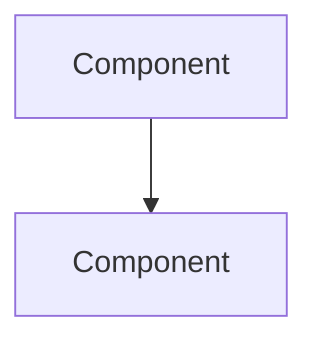

```yaml
Title: Architecture Spec Template
Version: 1.0.0
```

# 🏗️ [System Area] Architecture

## 1. Overview
[High-level summary of the system area]

## 2. Diagram


## 3. Key Decisions
- [Decision 1]
- [Decision 2]
